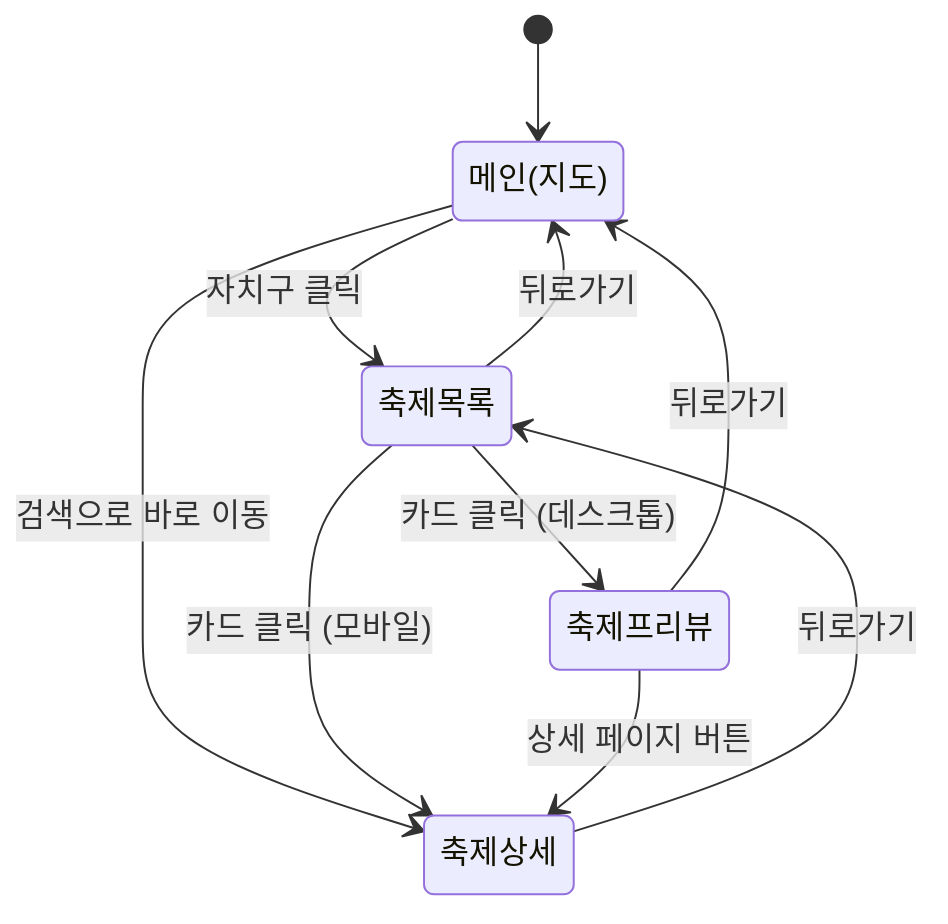
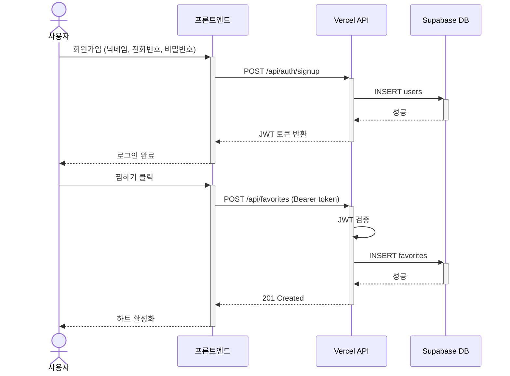
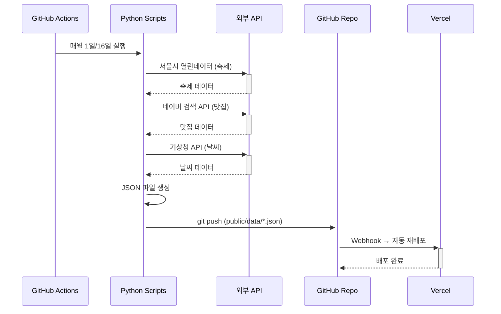
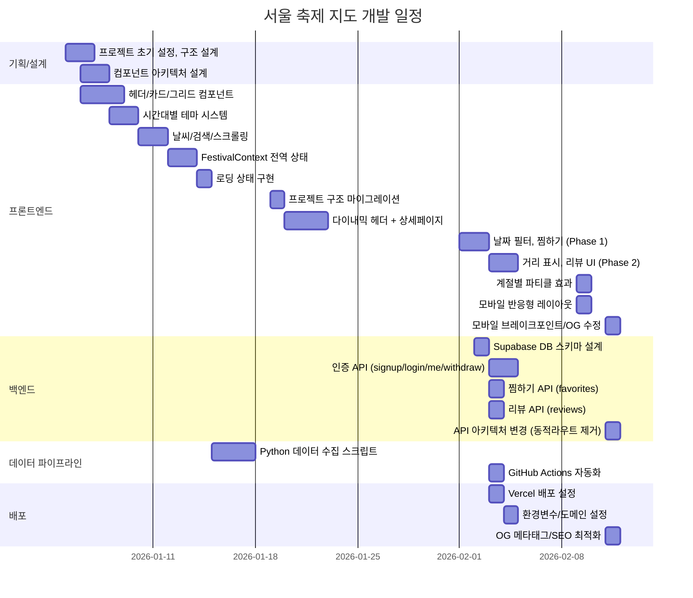
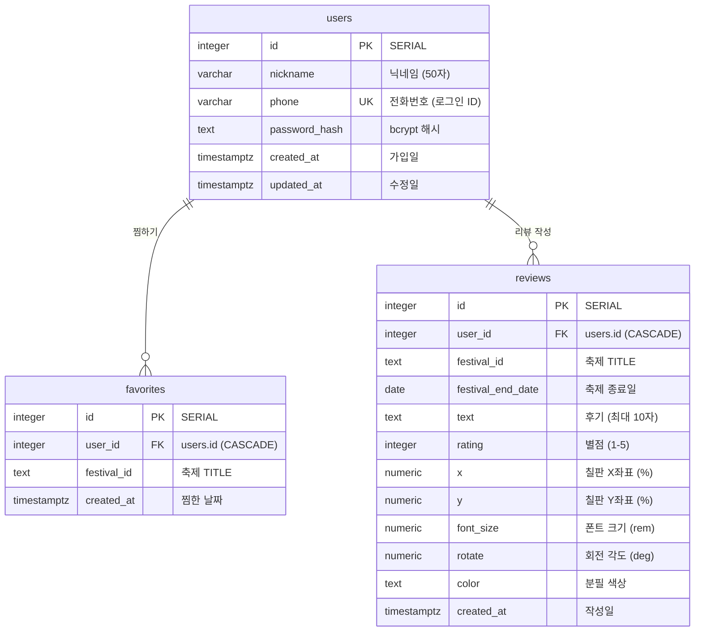
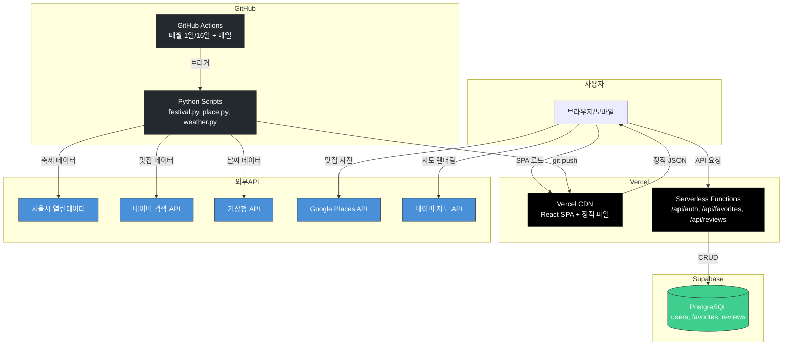
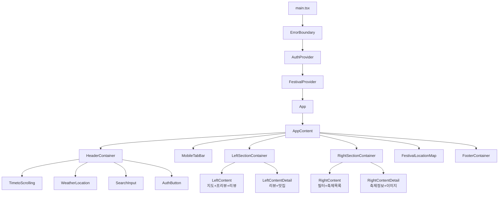

# 서울 축제 지도 (Seoul Festival Map)

## 1. 목표와 기능

### 1.1 목표
- 서울시에서 열리는 **모든 축제 정보**를 한눈에 볼 수 있는 지도 기반 서비스
- 자치구별 축제 탐색 → 상세 정보 확인 → 주변 맛집까지 원스톱 제공
- 시간대별 동적 테마(아침/낮/저녁/밤)로 몰입감 있는 UX 제공
- Python 데이터 파이프라인으로 축제/맛집/날씨 정보 자동 수집 및 갱신

### 1.2 기능
- **지도 기반 탐색**: 서울 25개 자치구 인터랙티브 SVG 지도, 호버/클릭 상호작용
- **축제 검색**: 축제명, 장소명, 자치구명, 맛집 이름으로 실시간 검색 + 키보드 네비게이션
- **축제 상세 정보**: 기본 정보, 프로그램 설명, 네이버 지도 연동, 주변 맛집 + 길찾기
- **시간대별 테마**: 06시-밤까지 4단계 그라데이션 배경 + 해/달 궤도 애니메이션
- **계절별 파티클**: 봄(벚꽃), 여름(별), 가을(낙엽), 겨울(눈) 이펙트
- **날씨 정보**: 현재 온도, 최고/최저 기온, 날씨 상태 표시
- **사용자 인증**: 전화번호 + 비밀번호 회원가입/로그인 (JWT 7일 토큰)
- **찜하기**: 축제 즐겨찾기 (로그인 시 서버 동기화, 비로그인 시 localStorage)
- **축제 리뷰**: 칠판 스타일 UI, 별점(1-5) + 후기(10자), 1인 1리뷰 제한
- **정렬/필터**: 날짜 필터, 거리순 정렬 (위치 권한 기반)
- **모바일 반응형**: 1280px 기준 모바일/데스크톱 분기, 지도/목록 탭 전환

### 1.3 팀 구성

<table>
	<tr>
		<th>강우석</th>
	</tr>
 	<tr>
		<td><!-- 실제 사진 업로드 필요 --></td>
	</tr>
	<tr>
		<td>풀스택 (FE + BE + Data Pipeline)</td>
	</tr>
</table>

## 2. 개발 환경 및 배포 URL

### 2.1 개발 환경

| 분야 | 기술 |
|------|------|
| **프론트엔드** | React 19 + TypeScript + Vite + Tailwind CSS 4 |
| **애니메이션** | Motion (Framer Motion) + tsparticles |
| **상태관리** | React Context API (Auth, Data, Filter, Navigation) |
| **지도 API** | Naver Maps API + Google Places API |
| **백엔드** | Vercel Serverless Functions (Express.js + TypeScript) |
| **데이터베이스** | Supabase (PostgreSQL) + RLS 정책 |
| **인증** | JWT (jsonwebtoken) + bcryptjs |
| **데이터 수집** | Python 3.10+ (서울시 열린데이터, 네이버 API, 기상청 API) |
| **CI/CD** | GitHub Actions (자동 데이터 수집) + Vercel (자동 배포) |
| **코드 품질** | ESLint + Prettier |

```bash
# 패키지 설치
pnpm install

# 개발 서버 실행
pnpm dev

# 프로덕션 빌드
pnpm build
```

### 2.2 배포 URL

- https://seoulfestivalmap.vercel.app

### 2.3 URL 구조

**프론트엔드 (SPA 라우팅)**

| URL 패턴 | 뷰 모드 | 설명 |
|----------|---------|------|
| `/` | map | 메인 화면 (서울 SVG 지도 + 계절 버튼) |
| `/{자치구명}` | list | 해당 자치구 축제 목록 |
| `/{자치구명}/{축제명}` | detail | 축제 상세 페이지 (리뷰, 맛집, 네이버 지도) |

**백엔드 API**

| App | HTTP Method | URL | 설명 | 로그인 필요 |
|-----|------------|-----|------|:-----------:|
| auth | POST | `/api/auth/signup` | 회원가입 | ✅ |
| auth | POST | `/api/auth/login` | 로그인 | ✅ |
| auth | POST | `/api/auth/logout` | 로그아웃 | ✅ |
| auth | GET | `/api/auth/me` | 현재 사용자 정보 | ✅ |
| auth | DELETE | `/api/auth/withdraw` | 회원 탈퇴 | ✅ |
| favorites | GET | `/api/favorites` | 찜 목록 조회 | ✅ |
| favorites | POST | `/api/favorites` | 찜 추가 (body: festivalId) | ✅ |
| favorites | DELETE | `/api/favorites?festivalId=...` | 찜 삭제 | ✅ |
| reviews | GET | `/api/reviews?festivalId=...` | 리뷰 조회 | ✅ |
| reviews | POST | `/api/reviews` | 리뷰 작성 (body: festivalId, text, rating, ...) | ✅ |
| reviews | DELETE | `/api/reviews/delete/{reviewId}` | 리뷰 삭제 | ✅ |

## 3. 요구사항 명세와 기능 명세

### 상태 흐름도



### 사용자 인증 시퀀스



### 데이터 수집 흐름



## 4. 프로젝트 구조와 개발 일정

### 4.1 프로젝트 구조

```
SeoulFestivalMap/
├── index.html                    # SPA 진입점 (OG 메타태그 포함)
├── package.json
├── pnpm-lock.yaml
├── vite.config.ts
├── vercel.json                   # Vercel 배포 설정 (rewrites, functions)
├── tailwind.config.js            # Tailwind 설정 (md: 1280px)
├── eslint.config.js
│
├── api/                          # 백엔드 (Vercel Serverless Functions)
│   ├── lib/
│   │   ├── supabase.ts           # Supabase 클라이언트
│   │   └── auth.ts               # JWT 검증 + bcrypt 유틸리티
│   ├── schema.sql                # DB 스키마 (users, favorites, reviews)
│   ├── auth/
│   │   ├── signup.ts             # 회원가입
│   │   ├── login.ts              # 로그인 (JWT 7일 토큰)
│   │   ├── logout.ts             # 로그아웃
│   │   ├── me.ts                 # 현재 사용자 정보
│   │   └── withdraw.ts           # 회원 탈퇴
│   ├── favorites/
│   │   └── index.ts              # GET/POST/DELETE 통합
│   └── reviews/
│       ├── index.ts              # GET/POST 통합
│       └── delete/
│           └── [reviewId].ts     # 리뷰 삭제
│
├── py_scripts/                   # 데이터 수집 파이프라인 (Python)
│   ├── config.py                 # API 키 관리
│   ├── main.py                   # 실행 진입점
│   └── modules/
│       ├── festival.py           # 서울시 열린데이터 → festival_data.json
│       ├── place.py              # 네이버 검색 API → place_data.json
│       └── weather.py            # 기상청 API → weather_data.json
│
├── public/
│   ├── robots.txt
│   ├── sitemap.xml
│   ├── og-image.png              # OG 이미지 (800×400, 카카오톡 미리보기용)
│   └── data/
│       ├── festival_data.json    # ~300개 축제 정보
│       ├── place_data.json       # 축제별 주변 맛집
│       └── weather_data.json     # 서울 날씨 정보
│
└── src/
    ├── main.tsx                  # React 루트 (ErrorBoundary → AuthProvider → FestivalProvider)
    ├── App.tsx                   # 메인 레이아웃 + 라우팅 (viewMode 기반)
    ├── index.css                 # Tailwind + CSS 변수 (시간대별 테마)
    │
    ├── atoms/                    # 기본 UI 컴포넌트
    │   ├── Badge.tsx             # 배지 (5가지 variant)
    │   ├── CardLayout.tsx        # 카드 레이아웃 (테마별 스타일)
    │   ├── ChalkboardComment.tsx # 칠판 댓글 표시 (랜덤 위치/크기/각도)
    │   ├── FilterButton.tsx      # 필터 버튼
    │   ├── SeasonButton.tsx      # 계절 선택 버튼
    │   ├── StarRating.tsx        # 별점 표시
    │   ├── LazyImage.tsx         # 지연 로딩 이미지
    │   ├── BackButton.tsx        # 뒤로가기 버튼
    │   └── ...
    │
    ├── components/               # 합성 컴포넌트
    │   ├── AuthButton.tsx        # 헤더 로그인/사용자 버튼 + 드롭다운
    │   ├── AuthModal.tsx         # 로그인/회원가입 모달
    │   ├── FestivalCard.tsx      # 축제 카드 (이미지, 평점, 찜하기)
    │   ├── FestivalReviewSection.tsx # 칠판 리뷰 섹션 (readOnly 지원)
    │   ├── ChalkboardInput.tsx   # 칠판 입력 폼 (별점 + 텍스트)
    │   ├── SearchInput.tsx       # 검색 입력 (드롭다운, ARIA)
    │   ├── MobileTabBar.tsx      # 모바일 탭 바 (지도/목록)
    │   ├── TimetoScrolling.tsx   # 시간대별 해/달 궤도 애니메이션
    │   ├── WeatherLocation.tsx   # 날씨 정보 표시
    │   └── ...
    │
    ├── containers/               # 컨테이너 (비즈니스 로직)
    │   ├── SeoulMapContainer.tsx  # SVG 서울 지도 (25개 자치구)
    │   ├── FestivalListContainer.tsx # 축제 목록 (거리 계산, 정렬)
    │   ├── HeaderContainer.tsx   # 헤더 (모바일/데스크톱 분기)
    │   ├── LeftContent.tsx       # 왼쪽: 지도 + 축제 프리뷰 + 리뷰
    │   ├── RightContent.tsx      # 오른쪽: 필터 + 축제 목록
    │   ├── LeftContentDetail.tsx  # 상세: 리뷰 + 주변 맛집
    │   ├── RightContentDetail.tsx # 상세: 축제 정보 + 이미지
    │   └── ...
    │
    ├── pages/
    │   ├── NotFoundPage/         # 404 페이지
    │   └── FestivalDetailPage/   # 축제 상세 페이지 컴포넌트들
    │       ├── FestivalDetailInfo.tsx
    │       ├── FestivalLocationMap.tsx  # 네이버 지도
    │       ├── NearbyRestaurants.tsx    # 주변 맛집
    │       └── ...
    │
    ├── contexts/                 # 전역 상태 (React Context)
    │   ├── AuthContext.tsx        # 인증 (JWT, 로그인/로그아웃)
    │   ├── DataContext.tsx        # 데이터 로딩 (JSON fetch)
    │   ├── FilterContext.tsx      # 필터/찜하기 상태
    │   ├── FestivalContext.tsx    # 통합 컨텍스트 (Data + Filter + Navigation)
    │   └── NavigationContext.tsx  # 뷰 모드, 축제 선택 상태
    │
    ├── hooks/
    │   ├── useFestivalContext.ts  # FestivalContext 편의 훅
    │   ├── useNaverMap.ts        # 네이버 지도 초기화
    │   ├── useTimePhase.ts       # 시간대 감지 (아침/낮/저녁/밤)
    │   └── useUrlSync.ts         # URL ↔ 상태 양방향 동기화
    │
    ├── utils/                    # 유틸리티
    │   ├── distance.ts           # 거리 계산 (geolib)
    │   ├── googlePlaces.ts       # Google Places API
    │   ├── naverMap.ts           # 네이버 지도 스크립트 로드
    │   ├── rating.ts             # 별점 계산 (buzz_score → 별점)
    │   └── theme.ts              # 테마 유틸리티
    │
    ├── constants/
    │   ├── guData.ts             # 25개 자치구 중심 좌표
    │   ├── textConstants.ts      # UI 텍스트 상수
    │   └── WeatherIcons.ts       # 날씨 아이콘 매핑
    │
    ├── types/
    │   ├── festival.ts           # Festival, Place, Weather 타입
    │   ├── chalkboard.ts         # ChalkboardComment 타입
    │   └── naverMap.d.ts         # 네이버 지도 타입 선언
    │
    └── lib/
        ├── api.ts                # API 클라이언트 (fetch 래퍼)
        └── utils.ts              # cn() 유틸리티 (clsx + tailwind-merge)
```

### 4.2 개발 일정(WBS)



## 5. 역할 분담

- 1인 개발 (풀스택)
  - **FE**: React 19 + TypeScript + Tailwind CSS + Framer Motion
  - **BE**: Vercel Serverless Functions + Supabase PostgreSQL
  - **Data**: Python 데이터 파이프라인 + GitHub Actions 자동화
  - **Design**: Tailwind CSS + CSS Variables (시간대별 테마)
  - **DevOps**: Vercel 배포 + GitHub Actions CI/CD

## 6. 와이어프레임 / UI / BM

### 6.1 와이어프레임

<!-- 피그마 또는 카카오 오븐으로 제작한 와이어프레임 이미지 필요 -->
<!-- 권장: 피그마에서 메인/목록/상세 페이지 3장 제작 후 스크린샷 -->

### 6.2 화면 설계

<!-- 각 화면의 스크린샷 또는 GIF 필요 -->
<!-- 권장: 배포 사이트에서 각 화면 캡처 후 readmeImg/ 폴더에 저장 -->

<table>
    <tbody>
        <tr>
            <td>메인 (낮 테마)</td>
            <td>메인 (밤 테마)</td>
        </tr>
        <tr>
            <td>
                <!-- 사진 필요: 낮 시간대 메인 화면 스크린샷 (SVG 지도 + 해 궤도 배경) -->
                
            </td>
            <td>
                <!-- 사진 필요: 밤 시간대 메인 화면 스크린샷 (SVG 지도 + 달 궤도 + 눈/별 파티클) -->
                
            </td>
        </tr>
        <tr>
            <td>축제 목록</td>
            <td>축제 프리뷰</td>
        </tr>
        <tr>
            <td>
                <!-- 사진 필요: 자치구 선택 후 축제 카드 목록이 오른쪽에 표시된 화면 -->
                
            </td>
            <td>
                <!-- 사진 필요: 축제 카드 클릭 후 왼쪽에 프리뷰 (이미지+정보+칠판 리뷰) 표시된 화면 -->
                
            </td>
        </tr>
        <tr>
            <td>축제 상세</td>
            <td>네이버 지도 (오시는 길)</td>
        </tr>
        <tr>
            <td>
                <!-- 사진 필요: 상세 페이지 (축제 정보 + 리뷰 칠판 + 주변 맛집) -->
                
            </td>
            <td>
                <!-- 사진 필요: 상세 페이지 하단 네이버 지도 마커 표시 화면 -->
                
            </td>
        </tr>
        <tr>
            <td>로그인 모달</td>
            <td>칠판 리뷰 작성</td>
        </tr>
        <tr>
            <td>
                <!-- 사진 필요: AuthModal 로그인/회원가입 화면 -->
                
            </td>
            <td>
                <!-- 사진 필요: 칠판 스타일 리뷰 입력 (별점 + 10자 텍스트) 화면 -->
                
            </td>
        </tr>
        <tr>
            <td>모바일 (지도 탭)</td>
            <td>모바일 (목록 탭)</td>
        </tr>
        <tr>
            <td>
                <!-- 사진 필요: 모바일 뷰포트에서 지도 탭 선택 시 SVG 지도 전체 화면 -->
                
            </td>
            <td>
                <!-- 사진 필요: 모바일 뷰포트에서 목록 탭 선택 시 축제 카드 리스트 -->
                
            </td>
        </tr>
    </tbody>
</table>

## 7. 데이터베이스 모델링(ERD)



**제약 조건:**
- `favorites`: `UNIQUE(user_id, festival_id)` — 동일 축제 중복 찜 방지
- `reviews`: `UNIQUE(user_id, festival_id)` — 1인 1리뷰 제한
- `reviews.text`: `CHECK(char_length(text) <= 10)`
- `reviews.rating`: `CHECK(rating >= 1 AND rating <= 5)`
- RLS (Row Level Security) 활성화, 서비스 역할만 접근

**참고:** `festival_id`는 축제 TITLE(TEXT)로 저장. 축제 데이터는 JSON 파일에서 관리되므로 DB에 FK 없음. 축제가 JSON에서 사라져도 DB 데이터는 영구 보존.

## 8. Architecture

### 전체 시스템 아키텍처

<!--
  아키텍처 다이어그램 이미지 권장:
  - draw.io (https://app.diagrams.net/) 에서 제작하면 무료 + 고품질
  - 또는 Excalidraw (https://excalidraw.com/) 사용 (손그림 스타일)
  - PPT로도 가능

  포함할 내용:
  1. 사용자 (브라우저/모바일)
  2. Vercel CDN (React SPA 정적 파일)
  3. Vercel Serverless Functions (/api/*)
  4. Supabase PostgreSQL
  5. GitHub Actions (Python 스크립트)
  6. 외부 API (서울시 열린데이터, 네이버 API, 기상청 API, Google Places API)
  7. public/data/*.json (정적 데이터)
-->



### 컴포넌트 트리



## 9. 메인 기능

### 9.1 인터랙티브 SVG 서울 지도
서울시 25개 자치구를 SVG 패스로 렌더링. 각 자치구에 마우스 호버 시 하이라이트, 클릭 시 해당 지역 축제 목록으로 전환. 축제 마커와 축제 개수 뱃지가 자치구 중심 좌표에 오버레이됨.

### 9.2 시간대별 동적 테마
`useTimePhase` 훅이 현재 시간을 감지하여 4단계 테마(아침/낮/저녁/밤) 자동 전환. CSS 변수로 배경 그라데이션, 카드 색상, 텍스트 색상이 실시간 변경. `TimetoScrolling` 컴포넌트에서 해/달이 곡선 궤도를 따라 이동하는 애니메이션 표시.

### 9.3 칠판 스타일 리뷰 시스템
축제별 리뷰를 어두운 녹색 칠판 배경 위에 랜덤한 위치/크기/각도/색상으로 배치. 분필로 쓴 듯한 손글씨 폰트(Schoolbell) 사용. 별점(1-5)과 짧은 후기(10자 이내) 작성. 1인 1리뷰 제한으로 작성 후 입력폼 자동 숨김.

### 9.4 축제 상세 + 주변 맛집
축제 상세 페이지에서 기본 정보, 프로그램 설명, 이미지 갤러리 표시. Google Places API로 주변 맛집 사진 로드. 네이버 지도에 축제 위치 마커 표시 및 맛집에서 축제장까지 길찾기 링크 제공.

### 9.5 데이터 자동 수집 파이프라인
GitHub Actions가 매월 1일/16일에 Python 스크립트를 실행하여 서울시 열린데이터(축제), 네이버 검색 API(맛집), 기상청 API(날씨) 데이터를 JSON으로 수집. 자동 git push → Vercel 자동 재배포로 데이터 갱신.

## 10. 에러와 에러 해결

### 찜하기 405 (Method Not Allowed)

**발생상황**: 로그인 후 찜하기 버튼 클릭 시 405 에러

**원인**: Vercel 파일 기반 동적 라우팅(`[festivalId].ts`)이 축제명의 URL-encoded 특수문자(`:`, `[`, `]`, 공백 등)를 매칭 못함. 요청이 `index.ts`(GET만 처리)로 fallthrough됨.

**해결**: 동적 라우트 파일 삭제. POST는 `req.body`, DELETE는 `req.query`로 festivalId 전달하도록 API 아키텍처 변경.

---

### 리뷰 저장 실패

**발생상황**: 리뷰 작성 후 등록 버튼 클릭해도 저장 안 됨

**원인**:
1. `FestivalReviewSection` 컴포넌트가 렌더링되지 않고 있었음
2. `festivalEndDate`가 `YYYYMMDD` 형식으로 전송되지만 서버는 `YYYY-MM-DD` 기대
3. 찜하기와 동일한 URL 인코딩 문제

**해결**: 컴포넌트 렌더링 추가, 날짜 포맷 변환 로직 추가, body/query param 방식으로 전환.

---

### 네이버 지도 addListenerOnce is not a function

**발생상황**: 네이버 지도 API 인증 실패 시 `naver.maps.Event.addListenerOnce is not a function` 에러

**원인**: API 키 인증 실패 시 네이버 지도 SDK가 불완전하게 로드되어 `Event` 객체의 메서드가 존재하지 않음

**해결**: `typeof naver.maps.Event.addListener === 'function'` 방어 코드 추가. 실패 시 에러 메시지 표시하고 지도 없이 진행.

---

### 카카오톡 링크 미리보기 안 뜸

**발생상황**: 아이폰 카카오톡에서 사이트 링크 공유 시 미리보기 카드가 표시되지 않음

**원인**:
1. `og:image`가 상대경로(`/og-image.png`) — 카카오톡 크롤러는 절대경로 필수
2. `og-image.png` 파일이 `public/` 폴더에 미존재
3. `og:url`이 실제 배포 도메인과 불일치

**해결**: OG 메타태그를 절대경로로 수정, 도메인 통일. 배포 후 https://developers.kakao.com/tool/clear/og 에서 캐시 초기화.

---

### 모바일 레이아웃 깨짐 (768~1248px)

**발생상황**: 768px~1248px 사이 뷰포트에서 두 섹션이 wrap되지만 MobileTabBar가 안 보임

**원인**: Tailwind `md` 브레이크포인트(768px)에서 MobileTabBar를 숨기지만, 실제 두 섹션이 나란히 배치되려면 ~1248px 필요 (`min-w-146` × 2 + `gap-20`)

**해결**: `tailwind.config.js`에서 `md` 브레이크포인트를 1280px로 변경. 26개 `md:` 사용처가 자동 적용.

---

## 개발 진행도

### 완료된 기능 ✅
- [x] 서울 25개 자치구 SVG 지도 (호버, 클릭, 마커, 뱃지)
- [x] 시간대별 4단계 테마 (아침/낮/저녁/밤)
- [x] 해/달 궤도 애니메이션
- [x] 계절별 파티클 효과 (봄/여름/가을/겨울)
- [x] 축제 검색 (키보드 네비게이션, ARIA)
- [x] 축제 상세 페이지 + 네이버 지도 + 주변 맛집
- [x] 날씨 정보 표시
- [x] 사용자 인증 (회원가입/로그인/탈퇴)
- [x] 찜하기 (서버 동기화 + localStorage fallback)
- [x] 칠판 리뷰 (별점 + 후기, 1인 1리뷰)
- [x] 날짜 필터 (전체/진행중)
- [x] 거리순 정렬 (Geolocation)
- [x] 모바일 반응형 (탭 전환, 1280px 기준)
- [x] Python 데이터 파이프라인 + GitHub Actions 자동화
- [x] SEO 최적화 (OG 태그, sitemap, robots.txt)
- [x] 웹접근성 (ARIA, 키보드 네비게이션)

### 예정된 기능 📋
- [ ] 다국어 지원 (영어, 중국어, 일본어)
- [ ] 축제 알림 기능
- [ ] 축제 캘린더 뷰
- [ ] 프로필 수정 기능

---

## 라이센스

Copyright © 2026 Seoul Festival Map
